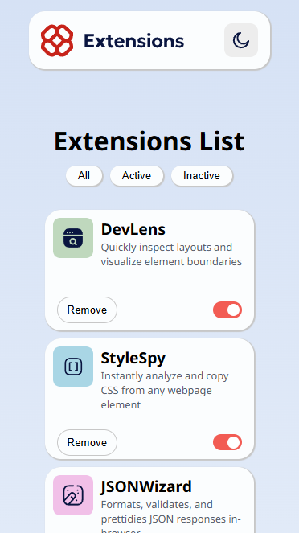

# Frontend Mentor - Browser extensions manager UI solution

This is a solution to the [Browser extensions manager UI challenge on Frontend Mentor](https://www.frontendmentor.io/challenges/browser-extension-manager-ui-yNZnOfsMAp). Frontend Mentor challenges help you improve your coding skills by building realistic projects.

### Screenshot

### Links

- Solution URL: (https://github.com/SV592/Frontend-Portfolio/tree/main/browser-extensions-manager-ui-main)
- Live Site URL: (https://sv592.github.io/Frontend-Portfolio/browser-extensions-manager-ui-main/)

## My process

### Built with

- Semantic HTML5 markup
- CSS custom properties
- Flexbox
- CSS Grid
- Media Queries
- DOM Manipulation

### What I learned

Apparently, some legacy DOMs on certain browsers had a function called "all()" and I found that out because I tried to call my custom "all()" function onclick and it didn't do anything.

Since there were no errors nor were my console.logs working, debugging it was "fun" 😐.

### Continued development

I could not figure out how to edit the color of the header SVG for the dark theme

## Author

- Website - [Shaquille Pearson](https://shaquillepearson.com/)
- Frontend Mentor - [@SV592](https://www.frontendmentor.io/profile/SV592)
