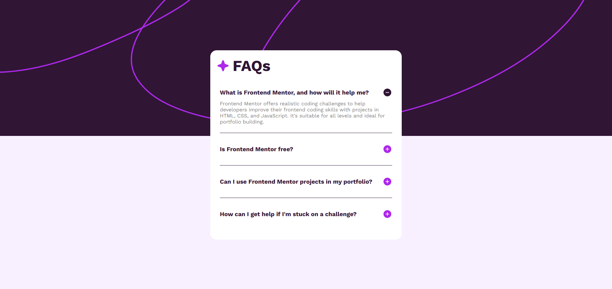
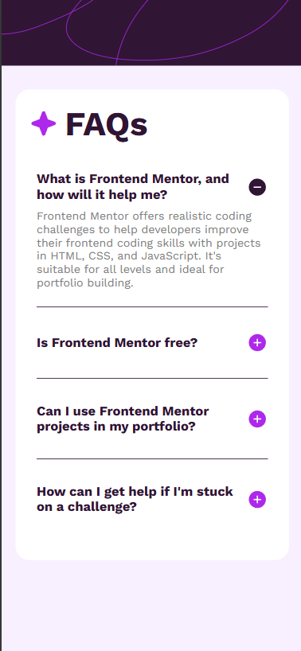

# Frontend Mentor - Huddle landing page with single introductory section solution

This is a solution to the [Huddle landing page with single introductory section challenge on Frontend Mentor](https://www.frontendmentor.io/challenges/huddle-landing-page-with-a-single-introductory-section-B_2Wvxgi0).

### The challenge

Users should be able to:

- View the optimal layout for the page depending on the device's screen size
- See hover states for all interactive elements on the page

### Screenshot

### Links

- Solution URL: (https://github.com/SV592/Frontend-Portfolio/tree/main/faq-accordion-main/)
- Live Site URL: (https://sv592.github.io/Frontend-Portfolio/faq-accordion-main/)

## My process

### Built with

- Semantic HTML5 markup
- CSS custom properties
- Flexbox

### What I learned

You can't use transitions on elements that have the display attribute

## Author

- Website - [Shaquille Pearson](https://shaquillepearson.com/)
- Frontend Mentor - [@SV592](https://www.frontendmentor.io/profile/SV592)
